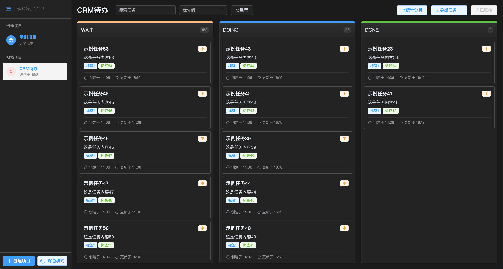

# 极简待办

一个简单好用UTools插件，类似Trello的待办事项管理工具

### 使用须知

请先下载[UTools](https://u.tools/)

在UTools中安装插件『极简待办』插件

### 插件使用

在UTools中输入『待办』或『todo』或『任务』或『task』即可打开

### 特性

- 支持任务分类
- 支持任务优先级
- 支持任务统计图表
- 支持任务导出
- 支持任务导入
- 通过拖拽的方式进行任务排序和状态流转

### 预览

